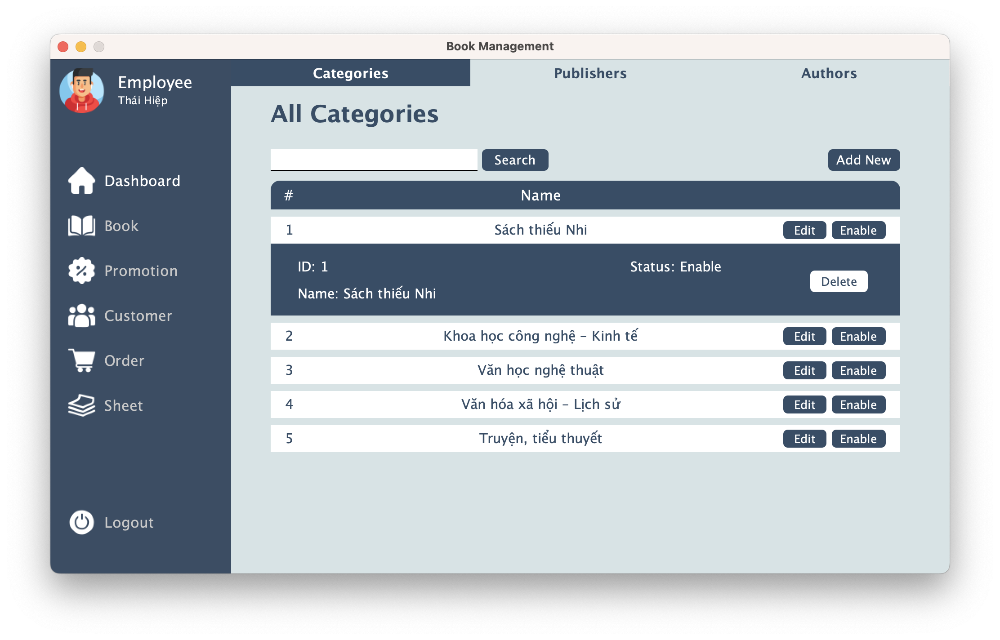
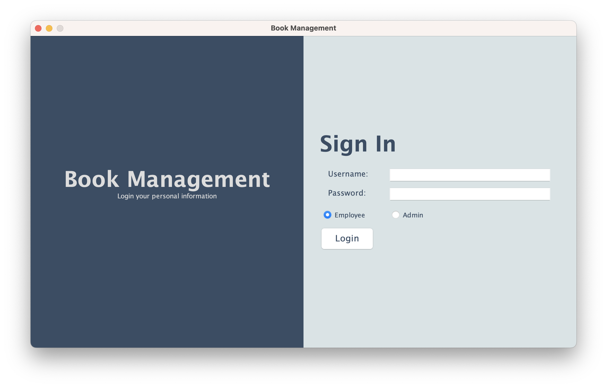
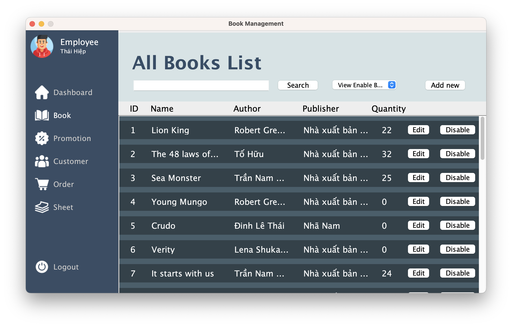
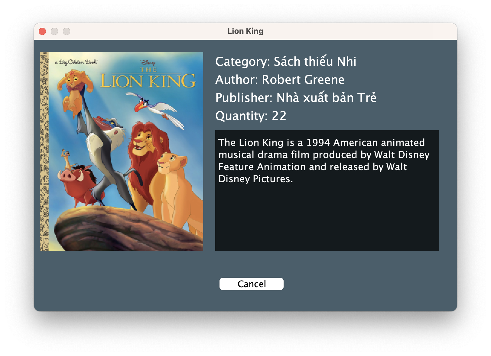
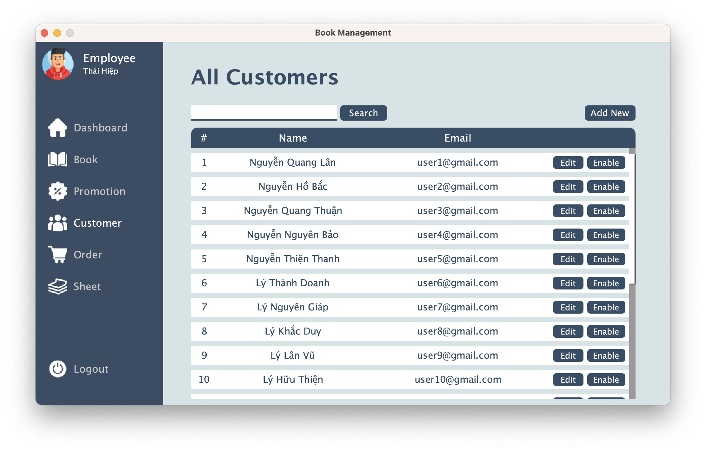
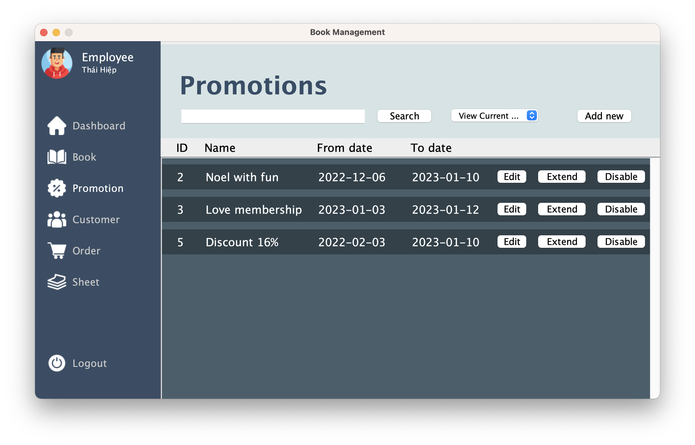
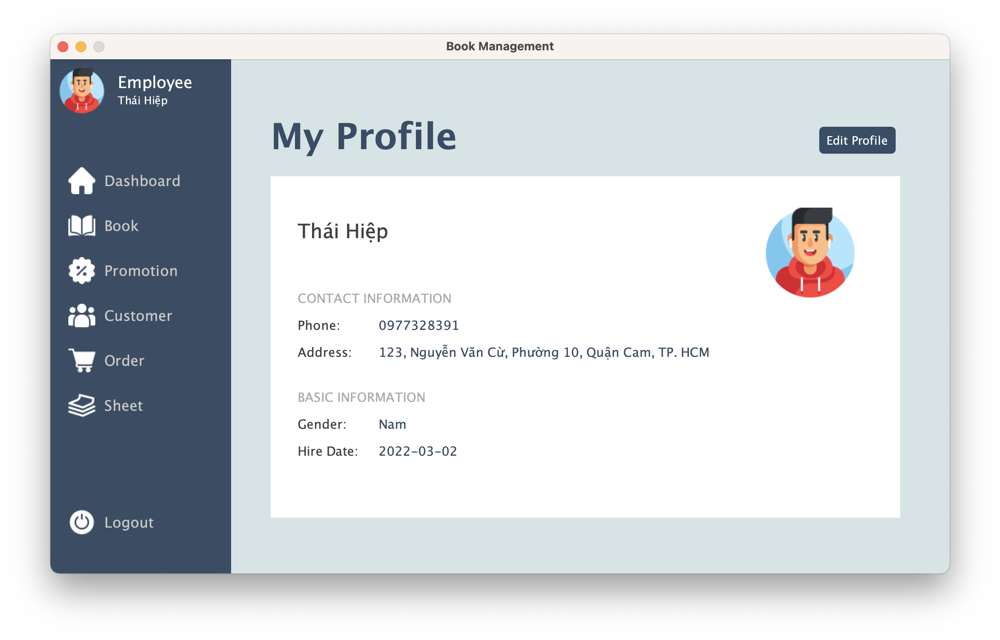
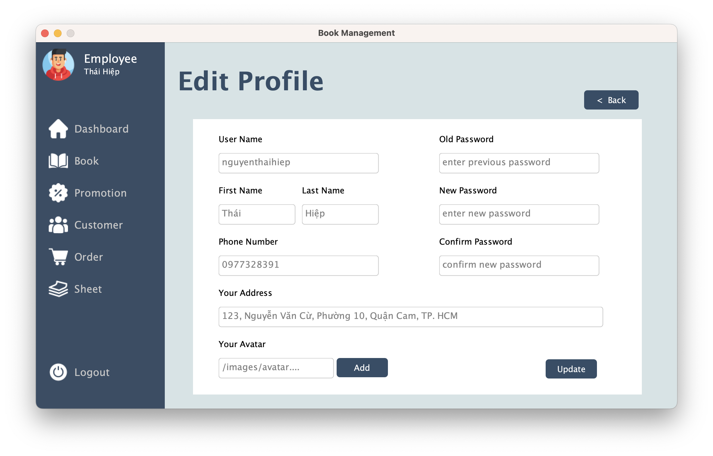
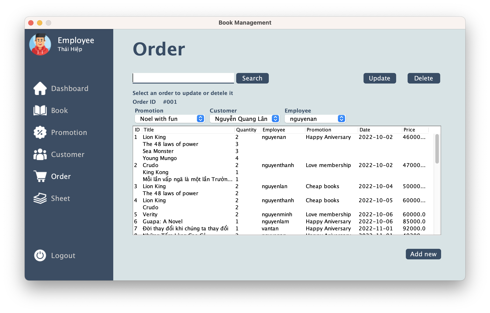

# BookStore Desktop Application

- Made with Java Language
- Made with Swing Framework for User Interface
- Made with MySQL Database
- The Project of **Java Programming** Subject (Ho Tuan Thanh, M.Sc Instructor)
- Scores: 9/10
- Members of the Group 05:

    1. Nguyễn Thái Hiệp - Leader
    2. Đinh Nguyễn Duy Khang
    3. Trần Nguyên Phong
- The percentage of each person's activities is 33.33%
# Requirements

- Install [Java](https://www.java.com/en/download/)
- Install [MySQL](https://www.mysql.com/downloads/)
- Install [IntelliJ IDEA](https://www.jetbrains.com/idea/download/)

# Development

```
- Run db_ver10.sql file in MySqlScript folder
- Include mysql-connector-j-8.0.31.jar library into the project 
```

# Deployment

```
Run App.java
```

**Note: This project runs on IntelliJ IDEA

# Overview

- HomePage
  
- LoginPage
  
- BookPage
  
- DetailOfBookPage
  
- CustomerPage
    
- PromotionPage
    
- ProfilePage
    
- EditProfilePage
    
- OrderPage
    

Authors: Nguyễn Thái Hiệp, Đinh Nguyễn Duy Khang, Trần Nguyên Phong


